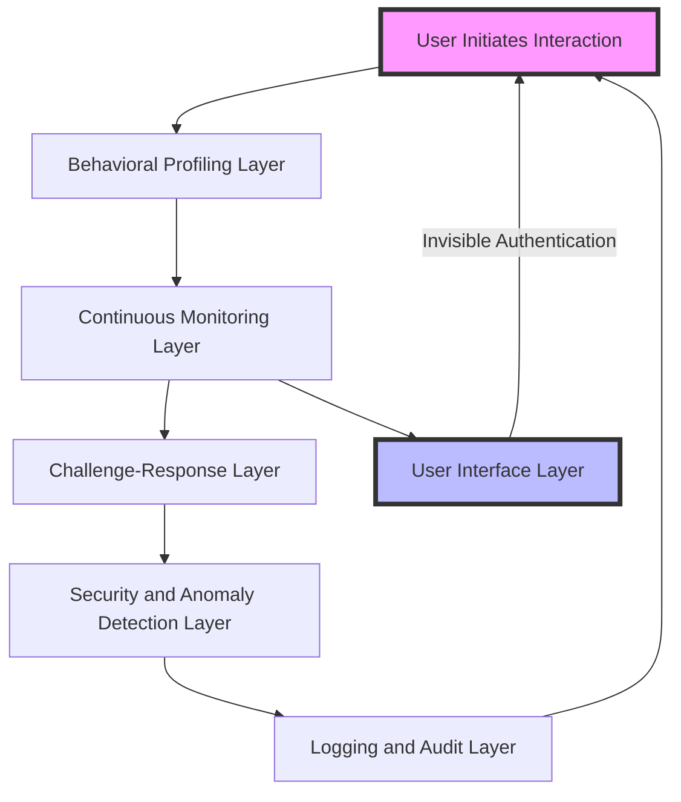
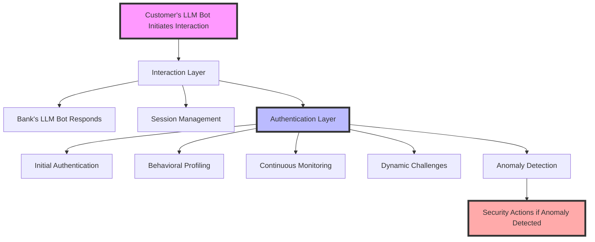

Certainly! The concept of non-intrusive security using behavioral fingerprinting for continuous authentication can indeed be thought of as a layered approach. Here are the layers involved in this method, each contributing to the overall security while maintaining a seamless user experience:

### Layers of Non-Intrusive Security

#### 1. **Behavioral Profiling Layer**
   - **Function**: This layer is responsible for creating and updating the unique behavioral profile of the LLM bot.
   - **Components**:
     - **Profile Creation**: Analyzes initial interactions to establish a baseline profile.
     - **Profile Storage**: Securely stores the created profiles for future reference.
     - **Profile Update**: Continuously refines the profile based on ongoing interactions.

#### 2. **Continuous Monitoring Layer**
   - **Function**: Monitors interactions in real-time to ensure they match the behavioral profile.
   - **Components**:
     - **Session Monitoring**: Continuously tracks all interactions during the session.
     - **Real-Time Analysis**: Analyzes responses in real-time for consistency with the stored profile.
     - **Anomaly Detection**: Identifies deviations from the expected behavior.

#### 3. **Challenge-Response Layer**
   - **Function**: Issues dynamic challenges to verify the authenticity of the LLM bot continuously.
   - **Components**:
     - **Dynamic Challenges**: Periodically issues challenges that require specific responses based on the profile.
     - **Response Analysis**: Evaluates the responses to these challenges to ensure they conform to the profile.

#### 4. **Security and Anomaly Detection Layer**
   - **Function**: Enhances security by detecting and responding to suspicious activities or anomalies.
   - **Components**:
     - **Anomaly Alerts**: Generates alerts if anomalies are detected during interactions.
     - **Incident Response**: Takes appropriate actions (e.g., logging out, additional verification) when anomalies are found.

#### 5. **Logging and Audit Layer**
   - **Function**: Maintains a detailed record of all interactions and authentication checks for audit and compliance.
   - **Components**:
     - **Interaction Logging**: Records all interaction details.
     - **Audit Trails**: Provides logs for auditing and compliance purposes.
     - **Compliance Checks**: Ensures that security measures comply with regulatory requirements.

#### 6. **User Interface Layer**
   - **Function**: Provides a seamless user experience without intrusive security measures.
   - **Components**:
     - **Invisible Authentication**: Ensures that the authentication process does not interfere with the user's interaction.
     - **Frictionless Interaction**: Maintains smooth and uninterrupted user sessions.

### Detailed Interaction of Layers

### Elaboration on Each Layer

#### Behavioral Profiling Layer
- **Initial Profiling**: Establishes the baseline behavior by analyzing initial interactions.
- **Profile Components**: Includes statistical properties like response variability, token distribution, entropy levels, and structural patterns.
- **Dynamic Updates**: Continuously updates the profile as more interactions occur.

#### Continuous Monitoring Layer
- **Real-Time Tracking**: Monitors all interactions in real-time, ensuring continuous authentication.
- **Pattern Matching**: Compares ongoing responses against the established profile.
- **Anomaly Detection**: Flags any deviations from the expected behavior.

#### Challenge-Response Layer
- **Dynamic Challenges**: Issues challenges based on specific parameters (e.g., temperature, topK).
- **Response Evaluation**: Analyzes responses to these challenges to verify authenticity.
- **Adaptive Challenges**: Adjusts challenges based on interaction context to ensure robust verification.

#### Security and Anomaly Detection Layer
- **Anomaly Alerts**: Raises alerts for any detected anomalies during interactions.
- **Incident Response**: Takes actions such as additional verification or session termination if anomalies are detected.
- **Proactive Security**: Ensures immediate response to potential security threats.

#### Logging and Audit Layer
- **Interaction Logging**: Records detailed logs of all interactions and authentication checks.
- **Audit Trails**: Provides a trail for auditing purposes, ensuring transparency and accountability.
- **Regulatory Compliance**: Ensures that all security measures and logs comply with regulatory standards.

#### User Interface Layer
- **Seamless Experience**: Ensures that the security process does not interrupt or inconvenience the user.
- **Invisible Authentication**: Authentication processes happen in the background, maintaining user satisfaction.
- **Frictionless Interaction**: Ensures that the user interaction remains smooth and uninterrupted.

### Summary

The layered approach to non-intrusive security ensures a robust and continuous authentication mechanism while maintaining a seamless user experience. Each layer plays a crucial role in providing comprehensive security without disrupting the user's interaction with the LLM bot, making it an innovative and effective method for securing banking interactions.

Got it, you’re looking at the layers in terms of the interaction and authentication processes happening concurrently but separately. Here’s a breakdown of those layers:

### Layered Approach to Interaction and Authentication

#### 1. **Interaction Layer**
   - **Function**: Handles the primary communication between the customer's LLM bot and the bank's LLM bot.
   - **Components**:
     - **Customer Requests**: The customer's LLM bot sends requests or queries.
     - **Bank Responses**: The bank's LLM bot processes these requests and provides appropriate responses.
     - **Session Management**: Manages the ongoing session between the customer and the bank's LLM bot.

#### 2. **Authentication Layer**
   - **Function**: Continuously authenticates the interaction to ensure security and legitimacy.
   - **Components**:
     - **Initial Authentication**: Verifies the identity of the customer's LLM bot at the start of the session using methods like OAuth or JWTs.
     - **Behavioral Profiling**: Creates a behavioral profile based on initial interactions.
     - **Continuous Monitoring**: Monitors interactions in real-time, comparing them against the behavioral profile.
     - **Dynamic Challenges**: Issues dynamic challenges to ensure responses match the behavioral profile.
     - **Anomaly Detection**: Detects deviations from the expected behavior and raises alerts if necessary.

### Interaction of Layers

Here’s how these layers interact concurrently to provide a seamless yet secure experience:

### Detailed Breakdown

#### Interaction Layer
- **Customer Requests**: The customer's LLM bot sends various requests or queries to the bank's LLM bot.
- **Bank Responses**: The bank's LLM bot processes these requests and provides the necessary responses.
- **Session Management**: Manages the state of the ongoing session, ensuring smooth communication between the bots.

#### Authentication Layer
- **Initial Authentication**: At the start of the session, the customer's LLM bot is authenticated using traditional methods like OAuth or JWTs.
- **Behavioral Profiling**: During the initial interactions, a behavioral profile is created for the customer's LLM bot, capturing unique response patterns and other behavioral traits.
- **Continuous Monitoring**: Throughout the session, interactions are continuously monitored in real-time, comparing ongoing responses to the stored behavioral profile.
- **Dynamic Challenges**: Periodically, the bank's LLM bot issues dynamic challenges that require specific responses. These challenges are designed based on the customer's behavioral profile.
- **Anomaly Detection**: Any deviations from the expected behavior are detected. If an anomaly is found, appropriate security actions are taken, such as alerting security personnel or terminating the session.

### Benefits of the Layered Approach

1. **Separation of Concerns**: Clearly delineates the interaction from the authentication process, allowing each to operate independently yet cohesively.
2. **Continuous Security**: Provides ongoing verification without disrupting the user experience, ensuring that interactions remain secure throughout the session.
3. **Real-Time Detection**: Enables real-time detection and response to anomalies, enhancing overall security.
4. **Seamless User Experience**: Maintains a smooth and uninterrupted user experience as authentication occurs in the background.

This approach ensures that while the customer's LLM bot interacts with the bank's LLM bot, the authentication layer works simultaneously to verify the legitimacy of the interaction, providing robust security without compromising user experience.
